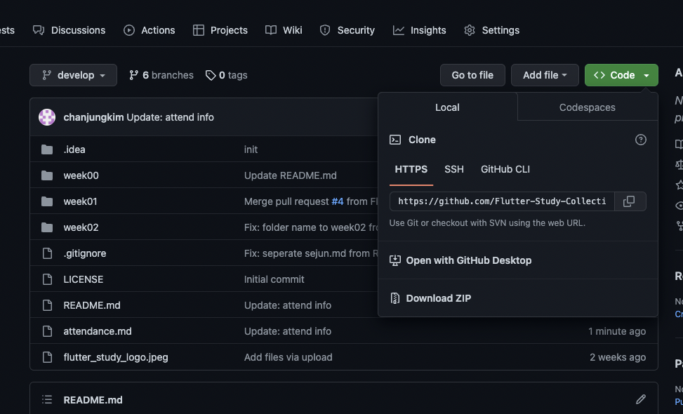

# 기본 세팅 및 레포지토리 관리 상세 설명

## Local Repository와 Retmote(origin) Repository 연동 방법

여러가지 방법이 있지만, 처음 접하시는 분에겐 Github Desktop이 간단합니다.

1. 다음 이미지와 같이 `< >Code`버튼(초록색)을 누르고, `Open with Github Desktop`을 선택합니다.



(Github Desktop이 없다면, 설치 후, Github 계정으로 로그인을 합니다.) 
2. Github Desktop 설치 및 로그인 성공이 되었을 경우, `Open with Github Desktop`을 선택하게 되면, Github Desktop에서 clone 프로세스가 진행됩니다.(다운로드 받을 위치 등)
3. clone이 완료되면 다음과 같이 연결이 되고, `current branch` 부분을 누르게 되면 local 뿐만 아니라 local에 없는 origin의 branch까지 보이게 됩니다.


이 때, 브랜치를 아무거나 선택하게 되면, 해당 브랜치로 이동하게 됩니다. (또한, 안드로이드 스튜디오에서 해당 프로젝트가 실행 중이라면, 해당 브랜치 내용으로 변경됩니다)

## 브랜치 생성 방법

### Github에서 생성하는 방법

1. 좌측 상단의 `develop` 버튼을 누르게 되면 모든 브랜치가 보이게 됩니다. 여기서 `View all branches`를 누릅니다.


2. 우측 상단에 보게 되면 초록색으로 `New Branch`란 버튼이 있습니다. 클릭합니다.


3. 원하는 브랜치 이름을 적고 브랜치를 생성합니다. (ex. feature/chan)


### terminal에서 생성 방법(remote branch와 연동이 되었을 때, 해당 폴더에서 진행)

checkout 시, -b 옵션을 주게 되면 새 브랜치가 생성되면서, 새 브랜치로 현재 브랜치를 이동합니다

ex.
```
git checkout -b feature/chan
```

혹은 branch 명령어로 새 브랜치를 생성만 할 수도 있습니다.

ex.
```
git branch feature/chan
```

### Github Desktop을 사용하는 방법

Current branch를 누르면, New Branch가 있습니다. 


## Pull Request

Pull Request란, B브랜치(ex. feature/chan)에서 A브랜치(ex. develop)으로 merge를 하기 전에 체크 용도로 많이 사용됩니다.

이 상태에서는 B브랜치와 A브랜치와의 차이를 볼 수 있으며, 한 줄 한 줄 마다 코멘트를 달 수도 있고, Pull Request 상태 자체에서 코멘트로 서로 의견을 주고 받을 수 있습니다.

ex. [android/architecture-samples](https://github.com/android/architecture-samples/pull/878) Pull Request 예시


### Pull Reuqest 하는 방법

#### Github Desktop에서 하는 방법

1. 모든 상태가 commit & push 여야 합니다. 그러면 아래 이미지와 같이 Create Pull Request 버튼이 보이게 됩니다.


2. Create Pull Request 버튼을 클릭하면, Github 페이지가 열리면서 Pull Reuqest 생성 페이지로 이동합니다. 여기서 title과 description을 작성합니다.


3. 완료된 화면입니다. 하단에는 해당 브랜치의 커밋과 기타 변경 사항 등에 대해 history가 남고, 코멘트를 주고 받을 수 있는 상태가 됩니다.


Optional: `File changed` 탭을 누르게 되면 전체 변경사항을 한 눈에 볼 수 있고, 각 커밋을 누르면 각 커밋에 관한 변경사항을 볼 수 있습니다. 이 때, 코드 줄번호 옆에 +버튼을 누르게 되면 해당 줄에 코멘트를 남길 수 있게 됩니다.

4. Merge pull request 버튼을 누르게 되면 B -> A 브랜치로 병합(Merge)가 됩니다. 이때, 서로 엉키는 내용이 있는 경우, conflict가 발생하게 되는데 resolve를 하게 되면 정상적으로 merge 가능한 상태가 됩니다.
