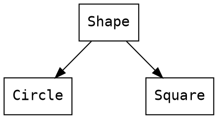
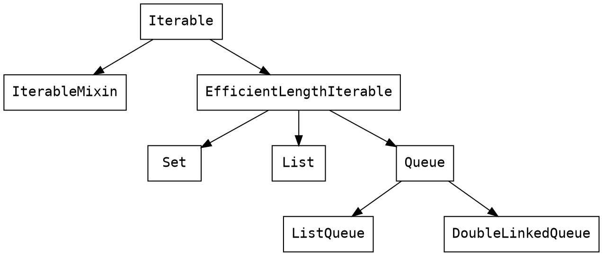

### Dart 입문

---

key words
- constructors
- parameters
- getters and setters
- privacy
- factories
- functional programming
- other concepts

---

#### entry point of dart

```
void main() {
    // start from here.
}
```

```
void main(List<String> args) {
    // you can get args from command line.
}
```

---

#### class

```!=
class Bicycle {
  int cadence;
  int speed;
  int gear;
}
```

```
fun main(){
  val bicycle = new Bicycle(2, 0, 1) // 에러
}
```

---

1. 생성자가 있어야한다.
```!=
class Bicycle {
  int cadence;
  int speed;
  int gear;
  
  // 추가된 내용
  Bicycle(int cadence, int speed, int gear)
      : this.cadence = cadence,
        this.speed = speed,
        this.gear = gear;
}
```

```
fun main(){
  val bicycle = Bicycle(2, 0, 1) // new 생략 가능
}
```

---

2. 모든 class는 toString()을 가지고 있다.
```
print(bycycle)

// 결과: Instance of 'Bicycle'
```
toString()을 오버라이딩하면 입맛에 맞게 출력할 수 있다.
```
class Bicycle {
  int cadence;
  int speed;
  int gear;
  
  ...
  
  @override
  String toString() => 'Bicycle: $speed mph';
  // $또는 ${}으로 변수를 따옴표 안에서 출력 가능하다.
}

// 결과: Bicycle: 0 mph
```

---

3. No public, private, or protected keywords

```
class Bicycle {
  ...
  int _speed = 0;
  int get speed => _speed;
  
  Bicycle(this.cadence, this.gear);
  
  @override
  String toString() => 'Bicycle: $speed mph';
}
```
read-only로 하려면 private으로 만들도록 변수명을 _로 시작해야하며, get 키워드를 사용하여 getter를 만들어야한다.
이 때, 해당값은 초기값이 있어야한다.(null도 가능)

---

4. class functions
```
class Bicycle {
  ...
  void applyBrake(int decrement) {
    _speed -= decrement;
  }

  void speedUp(int increment) {
    _speed += increment;
  }
}
```
class의 함수는 자바와 매우 흡사하다.
```
var bike = Bicycle(2, 1);
print(bike); // Bicycle: 0 mph
bike.applyBrake(2);
print(bike); // Bicycle: -2 mph
bike.speedUp(4);
print(bike); // Bicycle: 2 mph
```

---

5. optional named parameters
```
class Bicycle {
  ...
  // {, }로 감싸주었으며, defult값이 설정 되어있어야한다.
  Bicycle({this.cadence = 10, this.gear = 5}); 
  
  @override
  String toString() => 'Bicycle: $speed mph';
}
```

```
// 파라미터 갯수가 optional하게 줄어들 수 있으며,
// 따로 세팅 값이 없으면, default 값을 사용한다.
print(Rectangle(origin: const Point(10, 20), width: 100, height: 200));
print(Rectangle(origin: const Point(10, 10)));
print(Rectangle(width: 200));
print(Rectangle());
```

---

6. factory

```
abstract class Shape {
  num get area; // 상속 받으면 필수로 구현해야함. get은 getter를 의미함.
}
```
```
class Circle implements Shape { // Shape 상속
  final num radius;
  Circle(this.radius);
  num get area => pi * pow(radius, 2); // from Shape
}

class Square implements Shape { // Shape 상속
  final num side;
  Square(this.side);
  num get area => pow(side, 2); // from Shape
}

//  final circle = Circle(2);
//  final square = Square(2);
//  circle.area: 12.566370614359172
//  square.area: 4
```

---

Factory 구현
1. top-level function으로 구현하며, type param에 따라 객체 생성 후 반환함.
```
// top-level function: 아무 위치에서 정의 가능한 함수
Shape shapeFactory(String type) {
  if (type == 'circle') return Circle(2);
  if (type == 'square') return Square(2);
  throw 'Can\'t create $type.';
}
```

```
// 사용 시,
final circle = shapeFactory('circle');
final square = shapeFactory('square');
```

---

2. 생성자로 Factory를 구현
```
abstract class Shape {
  factory Shape(String type) { // factory 키워드 사용
    if (type == 'circle') return Circle(2);
    if (type == 'square') return Square(2);
    throw 'Can\'t create $type.';
  }
  num get area;
}
```
```
// 사용 시,
final circle = Shape('circle');
final square = Shape('square');
```

---

Circle과 Square은 Shape의 하위 클래스이다

⇨ Shape 타입으로 활용가능하다



```
//Circle과 Square은 Shape의 종류(하위 타입)이므로 return이 가능하다. 
Shape ...(...) {
  ... (...) return Circle(2);
  ... (...) return Square(2);
  ... '...';
}
```

---

#### interface

Dart 언어에는 모든 class가 interface를 정의하므로 *interface 키워드가 없다*. 하지만, 인터페이스 개념은 있다.

```
// interface 개념으로 사용되는 class.
class Circle implements Shape {
  final num radius;
  Circle(this.radius);
  num get area => pi * pow(radius, 2);
}
```
Circle을 상속하면 무조건 Circle의 내용에 맞게 구현해줘야한다.


---

```
class Circle implements Shape {
  final num radius;
  Circle(this.radius);
  num get area => pi * pow(radius, 2);
}

class CircleMock implements Circle {
  // 인스턴스 변수 구현
  num area = 0;
  num radius = 0;
}
```

---

#### Function Programming

nameless function
(= lamda expression, anonymous function) 
```
String scream(int length) => "A${'a' * length}h!";
```

```
// fold(), where(), join(), skip()
values.map(scream).forEach(print);

values.skip(1)
      .take(3)
      .map(scream)
      .forEach((item){
          print("$item")
      });
```

---

#### 기본 스타일
- 타입(class, enum 등)의 이름은 [UpperCamelCase](https://dart.dev/guides/language/effective-dart/style#do-name-types-using-uppercamelcase)
- 상수값은 [lowerCamelCase](https://dart.dev/guides/language/effective-dart/style#prefer-using-lowercamelcase-for-constant-names)

```
class Student
class DBIOPort // 축약된 말들은 대문자로
enum PaymentType
```
```
const defaultTimeout = 1000;
final urlScheme = RegExp('^([a-z]+):');
```
> 초기 Dart에서 SCREAMING_CAPS를 사용했지만 여러 이유로 인해변경됨)

---

- 불필요한 prefix 사용금지: _는 Dart에서는 private으로 인식하며, 그외의 이름에 prefix는 쓰지 않는다.
- 폴더/파일명과 package, import prefixes는 [lowercase_with_underscores](https://dart.dev/guides/language/effective-dart/style#do-name-packages-and-file-system-entities-using-lowercase-with-underscores)
```
my_package
└─ lib
   └─ some_file.dart
```
```
import 'package:some_component.dart' as some_component;
```
```
// Don't use prefix
_name
kDefaultTimeout
```

---

#### [Dart language cheatsheet](https://dart.dev/guides/language/cheatsheet)

1. Declaring fields

| type   | usage           |
|--------|-----------------|
| var    | mutable         |
| final  | only once assign|
| const  | compile time    |

---

2. Using literals

| expresion             | meaning                |          |
| ----------------------| ---------------------- | -------- |
| ‘Substitution ${val}’ |‘Substitution’ + val    |          |
| <type>[ ]             |List<type>              |          |
| const [1, 2, 3]       |compile-time            |          |
| = { }                 |new Map<>()             |          |

---

```
void main() {
  String val = "world";
  String greeting = 'Hello, ${val}!';
  print(greeting);
}
// Hello, world!
```

```
void main() {
  List<int> numbers = <int>[1, 2, 3];
  print(numbers);
}
// [1, 2, 3]
```

---

```
void main() {
  const List<int> numbers = const [1, 2, 3];
  print(numbers);
}
// [1, 2, 3]
```

```
void main() {
  Map<String, int> ages = {'Alice': 30, 'Bob': 25};
  print(ages);
}

// {Alice: 30, Bob: 25}
```

---

3. Checking types

| Syntax | Description |
|--------|-------------|
| as     | 캐스팅        |
| is     | 같은 타입 체크  |
| !is    | 다른 타입 체크  |

```
void main() {
  var name = 'Alice';

  print(name is String); // true
  print(name is int); // false
  print(name as int); // error: 상위 클래스가 다르면 캐스팅 불가
}
```

---

4. Chaining method calls

```
a.b = true;
a.c = 5;
```
같은 변수를 연속 사용할 때, 다음과 같이 사용할 수 있다. 
```
a..b = true..c = 5;
```

```
a..b = true
 ..c = 5;
```

---

5. Dealing with null

```
b ??= val; // If b is null, assign the value of val
a = value ?? 0; // If value is null, set a to 0
a?.b // a == null ? null : a.b
```

---

6. Implementing functions
```
// Named params with default values
fn({bool bold = false, bool hidden = false}) 

// Single return statement can be abbreviated.
int incr(int a) => a + 1;
```

```
void fn({bool bold = false, bool hidden = false}) {
  print('Bold: $bold, Hidden: $hidden');
}

void main() {
  fn(); // Bold: false, Hidden: false
  fn(bold: true); // Bold: true, Hidden: false
  fn(hidden: true, bold: true); // Bold: true, Hidden: true
}
```

---

7. Handling exceptions
```
try {...}
on MyException {...}
catch (e) {...}
finally {...}
```

---

8. Implementing constructors
```
Point(this.x, this.y);
factory Point(int x, int y) => ...;
// Named constructor
Point.fromJson(Map json) {
    x = json['x'];
    y = json['y'];
}
// Delegating constructor
Point.alongXAxis(num x) : this(x, 0);
// Const constructor: an object that will never change.
// All fields have to be final.
const ImmutablePoint(this.x, this.y);
// Initializer list 
Point.fromJson(Map jsonMap)
      : x = jsonMap['x'], y = jsonMap['y'];
```

---

Const constructor
```
class Person {
  final String name;
  final int age;
  final bool isEmployed;
  
  // 변경 불가능하다.
  const Person(this.name, this.age, {this.isEmployed = false});
  
  void printInfo() {
    print('Name: $name');
    print('Age: $age');
    print('Employed: $isEmployed');
  }
}

// usage
const person1 = Person('John', 30, isEmployed: true);
const person2 = Person('Jane', 25);
  
person1.printInfo();
person2.printInfo();
```

---

Named constructor
```
class Person {
  final String name;
  final int age;
  
  Person(this.name, this.age);
  
  Person.fromBirthYear(String name, int birthYear) : this(name, DateTime.now().year - birthYear);
  
  void printInfo() {
    print('Name: $name');
    print('Age: $age');
  }
}

// usage
final person1 = Person('John', 30);
final person2 = Person.fromBirthYear('Jane', 25);
  
person1.printInfo();
person2.printInfo();
```

---

Delegating constructor
```
class Person {
  final String name;
  final int age;
  final bool isEmployed;
  
  Person(this.name, this.age, {this.isEmployed = false});
  
  // name, age만 받고, isEmployed는 별도로 delegate하여 true로 생성
  Person.employed(String name, int age) : this(name, age, isEmployed: true);
  
  void printInfo() {
    print('Name: $name');
    print('Age: $age');
    print('Employed: $isEmployed');
  }
}

// usage
final person1 = Person('John', 30, isEmployed: true);
final person2 = Person.employed('Jane', 25);
  
person1.printInfo();
person2.printInfo();
```

---

#### [Method Cascades](https://news.dartlang.org/2012/02/method-cascades-in-dart-posted-by-gilad.html)

```
myTokenTable.add("aToken");
myTokenTable.add("anotherToken");
// many lines elided here
// and here 
// and on and on
myTokenTable.add("theUmpteenthToken");
```
⇨ 중복 코드가 많다

---

```
myTokenTable.add("aToken");
            .add("anotherToken");
            // many lines elided here
            // and here 
            // and on and on
            .add("theUmpteenthToken");
```
⇨ 이렇게 사용할 수 있으면 간단할 텐데... receiver를 리턴하지 않으면 할 수 없다.

---

```
myTokenTable..add("aToken");
            ..add("anotherToken");
            // many lines elided here
            // and here 
            // and on and on
            ..add("theUmpteenthToken");
```
⇨ 대신 Dart에는 method cascade 기능을 제공한다. ..를 사용하면 receiver를 재사용하는 게 아닌 원래의 데이터를 가져와서 연달아 작성할 수 있게 해준다.
```
getAddress()
  ..setStreet(“Elm”, “13a”)
  ..city = “Carthage”
  ..state = “Eurasia”
  ..zip(66666, extended: 6666);
```
그렇기에 위처럼 다양하게 사용할 수 있다.

---

#### Dart의 [Core Library](https://dart.dev/guides/libraries)

- dart:core
- dart:async
- dart:convert
- dart:collection
- dart:math

---

#### [Iterable collections](https://dart.dev/codelabs/iterables)

- List
- Set
- Map

---




---

#### [Dart Codelabs](https://dart.dev/codelabs)

- [From Java to Dart](https://developers.google.com/codelabs/from-java-to-dart#0)
- [Dart Cheatsheet](https://dart.dev/codelabs/dart-cheatsheet)
- [Iterables](https://dart.dev/codelabs/iterables)
- [Async Await](https://dart.dev/codelabs/async-await)
- [Null Safety](https://dart.dev/codelabs/null-safety)

---

#### 교재

[Dart in Action](https://livebook.manning.com/book/dart-in-action/chapter-8/8)
[Flutter in Action](https://edu.anarcho-copy.org/Programming%20Languages/Frontend/flutter/Flutter%20in%20Action.pdf)